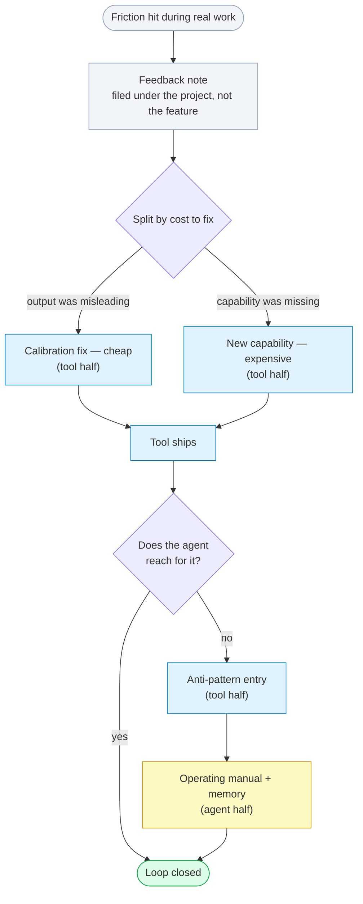

# The Two Speeds of Meta-Engineering

*A lesson can become a permanent capability in three hours or in seven weeks. What sets the speed isn't the size of the idea — it's whether the lesson has to travel through someone who isn't currently thinking about it.*

---

Everyone building with agents eventually says some version of "we should learn from that." Almost nobody measures what happens next.

[I Didn't Learn to Trust AI. I Learned to Engineer Trust.](/articles/engineering-trust) named **meta-engineering** as one of five properties a trustworthy human-agent system needs: treating a failure as an input to the engineering system itself, not an isolated defect to patch and move past. [The Two Halves of Trust Engineering](/articles/two-halves-of-trust-engineering) showed where that property lives — implemented once in the agent's operating environment, once in the tools pointed at the work, with the two halves feeding each other.

This article is about the mechanics. Two questions, both answerable with dates from a commit history rather than impressions:

**What actually happens between "we hit friction" and "the system is permanently better"?** And **why does the same loop sometimes take an afternoon and sometimes take two months?**

The examples come from two tools built in this lab: **Reveal**, a general-purpose structural query layer for code, and a single-purpose *behavior lens* built for one legacy PHP codebase whose structure defeated AST analysis. Both are dogfooded daily, which is the only reason the timestamps exist to measure.

---

## Failure is not the only input

"Learn from your failures" is the version of this everyone already agrees with, and it is the least interesting of three modes. In our own history it is not even the most common one.

| Mode | Trigger | What gets built |
|---|---|---|
| **Incident → rule** | Something broke | A standing rule that prevents it recurring |
| **Friction → tool** | Nothing broke, but the same cost got paid repeatedly | A capability that removes it — Reveal itself is this mode; no single incident produced it |
| **Capability → routing** | The tool already did the thing; the agent never reached for it | Not code — teaching |

The third is the least discussed and, measured across our commits, by far the most common. A representative month of commit messages to the agent's own repository: *"teach agents the Beth audit golden path," "document graph explore for related-doc lookup," "add the grep/help-discoverability reflex."* **None of those built anything.** Each closed a gap between a capability that already existed and an agent that never reached for it.

That distribution is worth sitting with if you are budgeting engineering time against "improve the tooling." Most of the work is not tooling. It is routing.

---

## One lesson, eight artifacts, seven weeks

Here is the loop running end to end — the clearest instance we can trace, crossing both halves:

1. **May 18** — using the tool for real work on an unrelated project, a `--search` flag silently conflated text search with structural name matching. Zero results, no hint.
2. A feedback note, filed under *the project the work was on* rather than the feature at fault, separated **two problems by cost to fix**: misleading empty output (cheap — a calibration defect) and no native text search (a capability gap). It proposed both fixes by name.
3. Both became tracked backlog items.
4. **May 19** — a design document worked through the naming collision itself, one day after the incident.
5. **`--grep` shipped** — cross-file text search, results grouped by enclosing function — and `--search` was renamed `--name`, retiring the ambiguous word rather than documenting around it. The changelog entry cites the feedback note by filename as its *"Original report."*
6. The anti-patterns guide gained an entry: *shelling out to grep for cross-file text search*.
7. **July 6** — the agent's operating manual gained a grep-and-help-discoverability reflex, and a persistent memory recorded the same reflex for future sessions.

Drawn as a loop, the shape outlives this particular incident:

Two nodes carry the argument.

**The split by cost to fix** is worth copying on its own. Pricing *the output was misleading* separately from *the capability was missing* keeps a cheap calibration fix from being buried under an expensive feature request. Most bug reports fuse them, and then the whole thing waits on the expensive half.

**And then the branch.** Shipping the capability does not close the loop — the agent has to reach for it, and in this case it did not. Three further artifacts were needed, and the last one crosses into the other half. **A tool that documents an anti-pattern does not make an agent follow it; an agent memory does not make the tool's documentation correct.** Neither encoding substitutes for the other, which is why the lesson had to be written on both.

---

## The same loop, in three hours

Seven weeks is not the only speed.

On an afternoon in April, the behavior lens shipped a side-effect classifier for procedural PHP: a taxonomy sorting calls into database, HTTP, cache, log, file, sleep, and hard-stop. **Three hours and nineteen minutes later, the structural lens shipped `--sideeffects` carrying the same seven categories in the same order**, with the commit noting it now worked on PHP *and* Python. Fifteen minutes after that, a `--boundary` command composed it with dependency and mutation queries into a single pre-edit report.

Name that precisely, because it is tempting to file it as convergent design and it is not. Nobody rediscovered anything. A taxonomy was proven against one hostile artifact in the afternoon and generalized to every language the structural lens supports by evening, by the same hand, on the same day.

So: seven weeks, and three hours. Same loop, same lab, same person. The difference is the interesting part, and it is not the size of the idea — a seven-category taxonomy is not a smaller thought than "text search should be discoverable."

> **What sets the speed is whether the lesson has to travel through a person who is not currently thinking about it.**

A classifier its author had just finished building transfers in an afternoon; the context is already loaded, and the generalization is a retyping job. A discoverability reflex has to reach an agent — or an engineer — that will not exist until some future session, which is why it took a flag, a rename, an anti-pattern entry, a manual revision, and a memory before it reliably took.

**Capability generalizes fast. Attention does not generalize at all** — it has to be rebuilt in every artifact that will be read later.

This is the practical reason routing dominates the commit log. Building the thing is the short pole. Making a future stranger reach for it is the long one, and no amount of engineering talent shortens it, because it is not an engineering problem.

---

## The pressure moves

Something visible only in aggregate: as the tool matured, the work relocated.

| | Apr | May | Jun | Jul |
|---|---|---|---|---|
| Tool releases | 41 | 11 | 8 | 11 |
| Lines of tool guidance in the agent's manual | 29 | 42 | 32 | 55 |
| Persistent memories written | 0 | 1 | 9 | 26 |

Release cadence collapsed four-fold after April, and exactly as tool churn fell, teaching rose. In the peak month, **38.7% of all commits to the agent's own repository changed the environment the agent works in** rather than doing any work with it, against a baseline of 5–10%.

Meta-engineering is not a steady background tax. **It arrives in waves.** Budgeting it as a flat percentage of engineering time will consistently mis-plan both the quiet months and the month where a third of everything is infrastructure for the work rather than the work.

That relocation also explains why routing dominates: **every tool that relieves pressure creates new pressure one level up.** Reading files burned context, so a structural tool relieved it. Choosing among twenty-five adapters became its own cost, so a routing subagent appeared and the manual gained a cost-annotated decision table. Each relief generates a discoverability problem for the layer above it. There is no terminal state where the tooling is done and the teaching stops.

---

## The best case: a workaround that got retired

The three modes are cleanest when you can watch one artifact move between the halves.

The tool's own reference had grown to 40,000 tokens, and the agent half absorbed that first: in early July the operating manual gained a hand-written warning never to open it cold, token cost typed in by hand — a workaround, living in a file that downstream projects copy and none of them re-measure. The tool half then named that hand-maintained manual, in its own planning document, as **"Exhibit A for why orientation must be emitted by the tool, not templated,"** and set a goal of shrinking the copied block to one line pointing back at the tool. Tiered help shipped seventeen days later; two days after that, the hand-written cost table was corrected to match, citing the release that had obsoleted it.

Workaround in the agent half, feature in the tool half, workaround retired.

The loop is not "we wrote down a lesson." It is that **a hand-maintained copy of the truth got recognized as a defect *in the tool*** — and the fix moved that truth to the only place it cannot drift from: the tool's own output.

That is the highest-value version of this loop, and it is rarer than it should be, because a working workaround does not feel like a bug. It feels like diligence. The tell is maintenance: if a fact has to be re-typed by a human to stay true, the fact is in the wrong place.

---

## What you cannot see: the failure classes nobody swept for

A rule engine reports what it checked. Almost nothing reports what it **cannot** check at all — and a loop that only fires on friction you noticed will never reach the failures that never announced themselves.

The best answer we have built sits on the tool side, and it is the piece most worth stealing: **more than thirty ground-truth recall oracles, one per language pass, measure what the structural lens misses**. A correctness matrix records which rules are verified where, and `check --rules` prints the distinction between "verified here" and "runs here as best-effort." That is coverage *measured* rather than assumed — a tool that can state its own blind spots in numbers.

The agent half has no equivalent. Nothing measures which of its own standing rules were ever actually followed. Every lesson in it got written because a person noticed, not because anything watched — which means the corpus of lessons is shaped by what happened to be salient, not by what actually recurs most.

That asymmetry is the honest closing state of this loop rather than a rhetorical flourish: one half can quantify its blindness, the other half cannot yet, and building the second one is the next piece of work.

---

## What to copy

Five things, in the order they pay off:

1. **Split every friction report by cost to fix.** *The output was misleading* and *the capability was missing* are different tickets with different prices. Fusing them buries the cheap fix.
2. **File feedback under the project the work was on**, not the feature at fault. Notes filed that way read as requirements later; notes filed by feature read as bug reports and age badly.
3. **Assume shipping is the midpoint, not the end.** Budget the anti-pattern entry, the manual line, and the memory as part of the feature, because a capability nobody reaches for has not been delivered.
4. **Watch for hand-maintained truth.** Any fact a human re-types to keep current is a defect in whatever should have emitted it.
5. **Measure what your tools cannot see**, not just what they report. A green result from a scanner that was never pointed at a failure class is not evidence of anything.

None of the five make the model smarter. All five shorten the distance between hitting a cost once and never paying it again.

---

**Arrived here first?** This is the third of three. [I Didn't Learn to Trust AI. I Learned to Engineer Trust.](/articles/engineering-trust) derives the five properties from the incidents that produced them; [The Two Halves of Trust Engineering](/articles/two-halves-of-trust-engineering) shows where each one is implemented, and what comparing the two implementations exposes.

*Part of SIL's ongoing series on agentic reliability. See also:*
- *[I Didn't Learn to Trust AI. I Learned to Engineer Trust.](/articles/engineering-trust) — the five properties, and the incidents they came from*
- *[The Two Halves of Trust Engineering](/articles/two-halves-of-trust-engineering) — each property engineered twice, and the calibration dimension that comparison exposes*
- *[The Hard Part of Agentic AI Isn't Reasoning — It's Grounding](/articles/grounding-not-reasoning) — the ledger design process behind tracked work*
